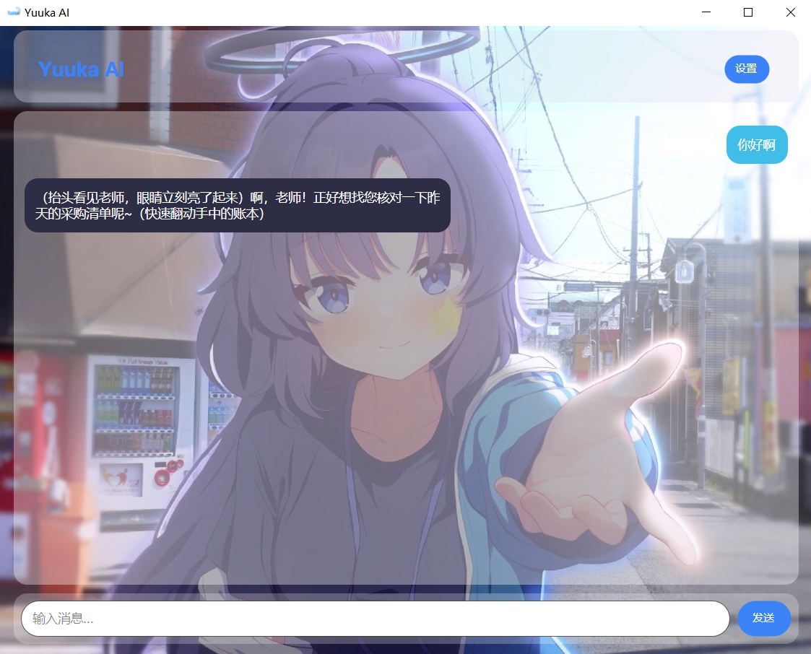

# YuukaAI GUI（YuukaAI V2）

[](https://dotnet.microsoft.com/)
[](LICENSE)
[](https://github.com/hu-Yz-hyz/yuukaai_gui)
[](https://bluearchive-cn.com/)

*注：GUI V2.0.0 完全重写，从 CLI 终端界面升级为跨平台图形界面*

> 🌸 与千年科学学园研讨会会计早濑优香（Hayase Yuuka）在图形界面中聊天

<div align="center">

</div>

## ✨ 新特性

-  **完全自定义 UI** - 支持深色/浅色模式、自定义主题色、背景图片
-  **多级菜单设置** - 分类清晰的设置面板，实时预览效果
-  **毛玻璃效果** - 可调整的区域透明度，打造个性化界面
-  **气泡样式自定义** - 用户/AI 气泡颜色、间距、圆角、内边距
-  **跨平台支持** - Windows（Linux、macOS、Android开发中）
-  **设置自动保存** - 配置自动保存到本地，下次启动自动加载

## 🚀 快速开始

### 下载运行

从 [Releases](https://github.com/hu-Yz-hyz/yuukaai_gui/releases) 下载对应平台的可执行文件。

### 配置 API Key

首次启动后，点击右上角 **「设置」** 按钮，在 **「API 设置」** 中配置：

1. 输入你的 API Key（留空使用默认）
2. 点击 **「保存并连接」**

> 🔑 获取 API Key：[阿里云百炼](https://bailian.console.aliyun.com/cn-beijing#/home)

### 自定义主题

打开设置面板，你可以：

- **常规设置** - 切换深色/浅色模式、调整字体大小和圆角
- **外观设置** - 选择主题色（20 种颜色）、调整各区域透明度
- **气泡设置** - 自定义用户和 AI 的气泡颜色、消息间距
- **背景设置** - 设置背景图片和不透明度


## 📦 构建发布

### 环境要求

- [.NET 10.0 SDK](https://dotnet.microsoft.com/download/dotnet/10.0)
- Windows/Linux/macOS 构建无需额外依赖
- Android 构建需要安装 [Android SDK](https://developer.android.com/studio)

### 构建命令

```bash
# 调试运行
dotnet run

# 发布 Windows 版本（框架依赖，单文件）
dotnet publish -f net10.0 -c Release -p:PublishSingleFile=true --self-contained false

# 发布 Android APK（需要 Android SDK）
dotnet publish -f net10.0-android -c Release
```


## 🏗️ 项目结构

```
yuukaai_cli/
├── Program.cs              # 程序入口点 & 主视图逻辑
├── yuukaai_cli.csproj      # 项目配置文件
├── Core/
│   ├── Client.cs           # AI 对话客户端
│   └── Models/
│       ├── Message.cs      # 消息模型
│       ├── ChatResponse.cs # API 响应模型
│       └── ChatChoice.cs   # 选择项模型
├── android/                # Android 平台代码（预留）
│   ├── MainActivity.cs     # Android 入口
│   └── Resources/          # Android 资源
└── favicon.ico             # 应用程序图标
```

## 🔧 自定义角色设定

你可以在 `Program.cs` 中修改 `CharacterPrompt` 常量来自定义角色行为和性格。

## 🖼️ 界面预览

### 主界面
- 简洁的聊天界面，气泡式消息展示
- 支持用户（右侧）和 AI（左侧）消息对齐
- 实时显示 "思考中..." 状态

### 设置面板
- 左侧分类菜单：常规、外观、气泡、背景、API
- 右侧详细设置，支持实时预览
- 支持主题色选择（20 种预设颜色）

## 📝 更新日志

### GUI V2.0.0
-  全新 GUI 界面，从 CLI 完全重构
-  支持深色/浅色模式切换
-  20 种主题色可选
-  毛玻璃效果和透明度调整
-  多级菜单设置面板
-  设置自动保存和加载
-  移动端界面优化

### CLI V1.4.5 LTS (旧版本)
- 终端命令行界面
- Spectre.Console 美化
- 基础对话功能

## 📜 许可证

本项目采用 [AGPL-3.0 许可证](LICENSE) 开源。

## 🙏 致谢

- [蔚蓝档案](https://bluearchive-cn.com/) - 早濑优香角色与蔚蓝档案的原作者
- [Avalonia UI](https://avaloniaui.net/) - 跨平台 .NET UI 框架
- [DeepSeek](https://deepseek.ai/) - 提供强大的语言模型
- [阿里云百炼](https://bailian.console.aliyun.com/cn-beijing#/home) - API 服务

## 🛣️ 开发计划

- [ ] 长期记忆能力
- [ ] 更多模型支持
- [ ] Markdown 渲染

## 📧 联系方式

如有问题或建议，欢迎通过以下方式联系：

- GitHub Issues: [提交问题](https://github.com/hu-Yz-hyz/yuukaai_gui/issues)
- Email: huyzhong@outlook.com
- BiliBili：[BiliBili](https://space.bilibili.com/1523473466)

支持开发：[爱发电](https://afdian.com/a/hu0503hu)

---

<p align="center">
  <i>"完美～与计算一致"</i>
</p>

